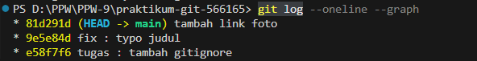
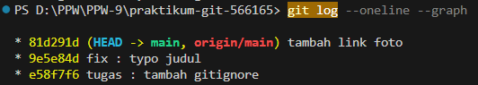
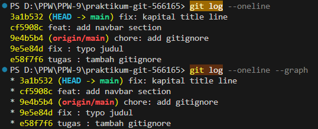
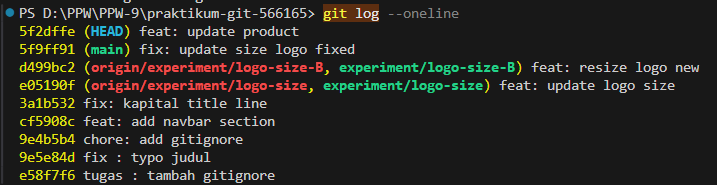
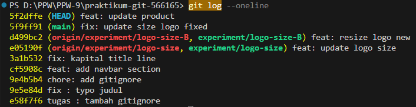
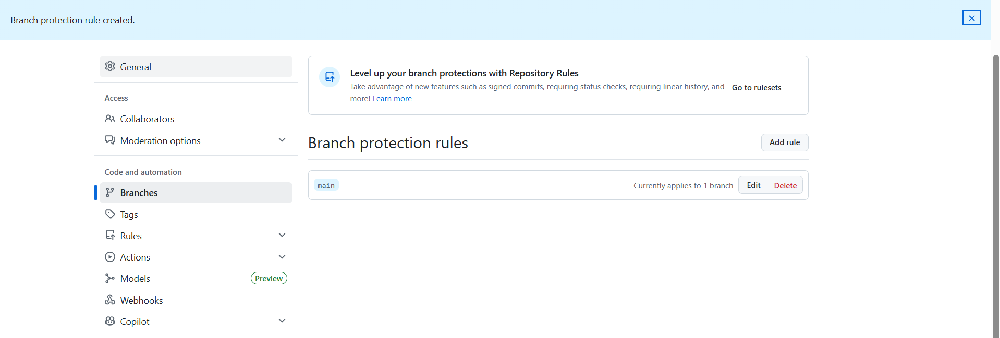

# Kaevrin Landing Page

Website landing page untuk brand outdoor "Kaevrin" yang menampilkan produk, testimonial, dan informasi brand.

## Cara Menjalankan
1. Clone repository
2. Buka file index.html di browser

## Screenshot

### Website

### Git Log

### Branch Protection

## Perintah Git

- `git init` → membuat repository
- `git add .` → menambahkan perubahan
- `git commit` → menyimpan perubahan
- `git branch` → membuat branch
- `git checkout` → pindah branch
- `git merge` → menggabungkan branch
- `git rebase -i` → menggabungkan commit
- `git push` → upload ke GitHub

## Dokumentasi Perintah Git yang Digunakan
* `git clone [url]`: Mengunduh *repository* dari GitHub ke penyimpanan lokal.
* `git add .`: Menambahkan semua perubahan file ke *staging area* sebelum di-*commit*.
* `git commit -m "[pesan]"`: Menyimpan perubahan secara permanen ke *history* Git lokal dengan pesan tertentu.
* `git push origin [branch]`: Mengunggah perubahan dari *branch* lokal ke GitHub.
* `git pull origin [branch]`: Mengambil dan menggabungkan pembaruan terbaru dari GitHub ke laptop lokal.
* `git checkout -b [nama-branch]`: Membuat *branch* baru sekaligus langsung berpindah ke *branch* tersebut.
* `git merge [nama-branch]`: Menggabungkan *history* dari *branch* lain ke *branch* yang sedang aktif.
* `git rebase -i HEAD~3`: Melakukan interaktif *rebase* untuk mengubah/menggabungkan (*squash*) 3 *commit* terakhir menjadi satu *commit* yang lebih rapi.